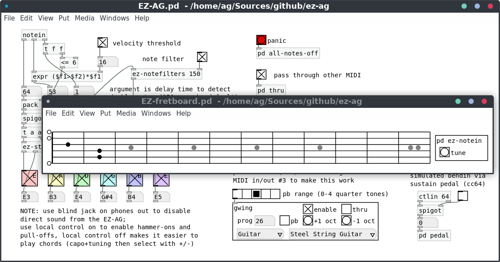
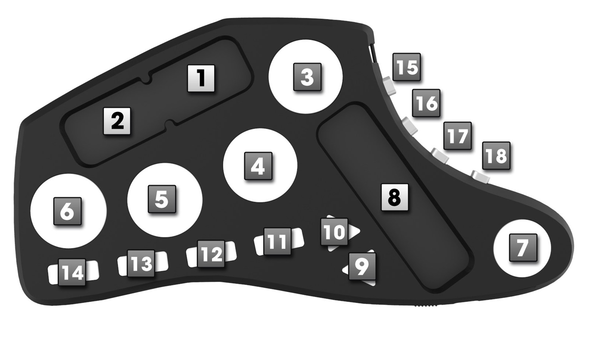

# EZ-AG Helper Patch

Copyright (c) 2017 by Albert Gräf <aggraef@gmail.com>, licensed under the GPL
v3 or later, please check the accompanying COPYING file for details. Sources
are availble at <https://github.com/agraef/ez-ag>.

This is a little helper patch which aims to make it easier to use Yamaha's
"learning guitar", the [Yamaha EZ-AG][], as a MIDI controller. (It should also
work with its sibling, the Yamaha EZ-EG, but I haven't tested that since I
don't own one of these.) The patch also displays the strings and notes which
are currently playing, which should be useful as visual feedback and for
checking that the device is connected and working properly.

  

[Yamaha EZ-AG]: https://www.bhphotovideo.com/c/product/353860-REG/Yamaha_EZAG_EZ_AG_Self_Teaching_Guitar.html

Note that Yamaha doesn't list (let alone sell) these any more, but with some
luck you'll be able to find one on Amazon or Ebay. There's an
extensive [KVR thread][] about the EZ-AG and EZ-EG which you can refer to for
further details.

[KVR thread]: https://www.kvraudio.com/forum/viewtopic.php?f=4&t=41787

The EZ-AG is in fact a full-blown MIDI guitar controller, but in its default
mode it is a bit hard to play in this way unless you have a *very* clean
playing style. This Pd patch makes that a bit easier by filtering out
low-velocity notes and spurious double notes which often turn up in the
EZ-AG's MIDI output when pushing fret buttons and picking strings at the same
time.

Another minor shortcoming of the EZ-AG is that, unlike the EZ-EG, it doesn't
have a facility to do pitch bends. The patch makes up for that by making it
possible to simulate pitch bends via a sustain pedal (note that you'll have to
hook up the pedal through a MIDI keyboard since the EZ-AG itself doesn't have
a sustain pedal input).

If you have the [Livid Guitar Wing][], you can also do pitch bends using
either the Wing's big fader (cc 3) or the uppermost drum pad (cc 36). The Wing
will also let you change instruments (GM patches) and transpose by octaves
up/down using some of its buttons (see below for details). Optionally, it is
also possible to pass through all control data from the Wing so that you can
route it, e.g., to your DAW program instead.

[Livid Guitar Wing]: http://lividinstruments.com/products/guitar-wing/

The EZ-AG and the Wing actually make for a very nice combo, since the Wing
will give you the button and fader controls which the EZ-AG lacks. If you
don't have the Wing, then you should still be able to do all these things by
operating the corresponding GUI controls in the gwing subpatch, but it will be
less convenient. Note that instrument sounds can also be changed using the
corresponding buttons on the EZ-AG itself (press SOUND SELECT and then +/-),
but this will not show in the GUI controls of the patch.

## Setting Up

You'll need the [Purr Data][] flavor of Pd to run this patch. You'll also
need [Pd-Lua][] since some of the internal functionality of the patch is
currently written in Lua. (There's a good chance that most of the essential
functionality of the patch will work in vanilla Pd, too, if you have Pd-Lua
installed, but this hasn't been tested. In any case making the patch work
flawlessly with vanilla will most likely require some changes.)

[Purr Data]: https://agraef.github.io/purr-data/
[Pd-Lua]: https://github.com/agraef/pd-lua

For starters, use Pd's preferences and/or your MIDI patchbay to hook up the
EZ-AG to Pd's MIDI input and output #1, the control input of your DAW (if
needed) to Pd's MIDI output #2, and finally the Guitar Wing (if you have it)
to Pd's MIDI input and output #3. The patch is hard-wired to work like this,
so unless you're prepared to edit the patch you'll need to follow this
connection layout.

The patch doesn't generate any sound of its own, it just outputs MIDI, so
you'll also need a GM-compatible synthesizer which should be hooked up to Pd's
MIDI output #1. I recommend Qsynth/Fluidsynth for that purpose, but of course
you can also use any GM-compatible synthesizer or a GM-compatible synth plugin
in your favorite DAW. In the latter case you will want to route Pd's MIDI
output #1 into your DAW (note that output #2 only carries the control data
from the Wing if it's being passed through).

For a minimum setup (no DAW control, no Guitar Wing) you can just hook up the
EZ-AG and your MIDI synthesizer to Pd's first MIDI input and output,
respectively, and be done with it.

### EZ-AG Setup

You will probably want to leave local control enabled on the EZ-AG (it's the
default) to get naturally-sounding hammer-ons and pull-offs. (Note that the
EZ-AG doesn't do pull-offs to empty strings. That's a limitation of the device
and so there's nothing the patch can do about it.) On the other hand, it may
become easier to play chords if you turn local control off; this can only be
done manually on the device by pressing the CAPO and TUNING buttons at the
same time and using the "-" button so that the EZ-AG's LED display shows
"Off". This disables hammer-ons and pull-offs and also turns off the EZ-AG's
local sound generation. (Note that you can also use a blind jack on the
EZ-AG's phones out if needed, in order to disable direct sound from the guitar
with local control enabled.)

Another important configuration item on the EZ-AG is the clock setting. The
EZ-AG should be set to use an *external* clock (the internal clock is the
default), if you do not want to run the risk of accidentally hitting the DEMO
START/STOP button and have the device conveniently start playing one of its
demo songs when you're in the middle of a guitar solo. The patch will try to
set this automatically for you by sending the appropriate sysex message on
Pd's MIDI output #1, but this requires that it is connected to the EZ-AG and
the device is on when the patch is loaded. In any case, you can also do this
manually by pressing the TEMPO and VOLUME buttons at the same time and using
the "-" button so that the EZ-AG's LED display shows "Etr".

## Usage

With those preparations all done and the EZ-AG turned on, just load the patch
and start playing. You should see the strings and notes being played in the
GUI, and hear the output from the patch through your MIDI synthesizer.

There are various settings in the patch you can fiddle with. First and
foremost, there are two toggles for the velocity threshold and the note
filtering, which should normally be enabled by default. You can turn these off
to get the MIDI note data exactly as the EZ-AG sends it. Normally, you will
want both of these to be turned on, though, which does two things:

- The velocity threshold causes removal of the "silent" notes that the EZ-AG
  produces when operating the fret without actually picking the strings.
  
- The note filter prevents double note-ons for the same note on the same
  string which often occur if you're pushing the fret button for a note and
  pick that string not exactly at the same time (which may well happen if
  you're a lousy guitar player like me).
  
The latter is only an issue if the EZ-AG has local control on (see above) so
that hammer-ons and pull-offs are enabled. The time threshold used to detect
these double notes can be set using the delay time argument of the
"ez-notefilters" abstraction. The default of 150 msecs works for me, but if
you have a very clean playing style then you might want to reduce this value.
On the other hand, if your technique is even worse than mine then you might
have to further increase the delay time.

The "pass through other MIDI" toggle causes all control and program change
messages emitted by the EZ-AG to be passed through unchanged. In particular,
this lets you use the buttons on the EZ-AG to change the selected instrument
sound.

The "panic" button lets you stop all sounding MIDI notes immediately, provided
that your MIDI synthesizer properly implements cc 123 (Fluidsynth does). This
is most useful for killing off hanging notes, should you run into these.

Finally, if you have a sustain pedal (cc 64) hooked up to your MIDI system (as
already mentioned, you'll have to do that through your MIDI keyboard), then
this can be used to emulate pitch bends if you turn on the corresponding
toggle in the patch. This is a rather crude emulation (it quickly ramps up one
semitone when pressing the pedal, and goes back to nominal pitch when
releasing it); better control is provided through the Guitar Wing, see below.

## Guitar Wing Controls

The "gwing" subpatch provides support for Livid's Guitar Wing controller.
There is a toggle in the subpatch to enable this functionality, which should
be on by default. The provided functions are listed below.

  

- The big touch fader of the Wing (cc 3, fader 8 in the figure above) does
  pitch bends. It will automatically reset itself to zero as soon as you stop
  touching that fader. The radio button above the gwing patch lets you
  configure the maximum amount of pitch bend that you want to have. It
  defaults to one semitone but can be set to anything between zero and four
  quarter tones. If zero, pitch bends are disabled. (This will only bend up
  right now; if needed, you can change the corresponding logic in the gwing
  subpatch. E.g., you might want to assign the little faders cc 1 and cc 2
  instead and allow for both upward and downward bends.)
  
- The first white pad on the Wing (button 3) provides an alternative way to
  control pitch bends. The pads are touch-sensitive, so applying different
  amounts of pressure on button 3 will translate to different pitch bend
  values. This is a bit harder to control than the big fader, but may be more
  convenient to do quick pitch bends.

- The second and third pads (buttons 4 and 5) can be used to transpose the
  MIDI note input from the EZ-AG (same as the +/-1 oct buttons in the patch).
  Note that this is independent from the TUNING button on the EZ-AG. Moreover,
  the EZ-AG automagically transposes notes depending on the instrument sound
  chosen with the SOUND SELECT button on the device, so that, e.g., if you
  pick a bass sound on the EZ-EG then the note input from the EZ-AG will
  already be an octave lower than normal.
  
- The fourth pad (button 6) is equivalent to clicking the "panic" button in
  the patch, i.e., it turns off all sounding notes.
  
- The direction buttons (buttons 9 and 10) can be used to switch between GM
  patches (instrument sounds). Also, the four little side buttons (buttons
  15-18) can be used to change the GM program number in larger increments. The
  current setting is shown in the "prog" field, as well as the two dropdown
  lists at the bottom of the abstraction, and can also be changed there.
  
- The remaining controls on the Wing aren't assigned right now, but might be
  in the future.

All this special processing can also be turned off with the "enable" toggle.
Finally, you can also route the control data from the Wing to your DAW. To
these ends, enable the "thru" toggle in the gwing subpatch and hook up your
DAW's control input to Pd's MIDI output #2.

## Ardour Support

As a bonus, I've thrown in an [Ardour][] MIDI map (Livid_GuitarWing.map in the
sources), which can be used to hook up the Wing to Ardour's Generic MIDI
Control, either directly or through the pass-through option of the gwing
subpatch described above. To make this work, you'll have to copy the
Livid_GuitarWing.map file to Ardour's midi_maps directory (on Linux this is
under ~/.config/ardour5/midi_maps/, please check the Ardour manual for
directions on Mac and Windows) and configure the Generic MIDI Control Surface
in Ardour's preferences accordingly. To do this, open the "Control Surfaces"
section in Ardour's preferences, enable "Generic MIDI", click "Show Protocol
Settings", pick "Livid Guitar Wing" as the MIDI binding and choose the Guitar
Wing for incoming MIDI.

[Ardour]: https://ardour.org/

The map assigns buttons 11-14 on the Wing to some of Ardour's transport
controls (at present: start, stop, as well as the metronome click and loop
toggles; you may want to adjust this to your liking or employ it as a
blueprint for doing your own map for your favorite DAW). The rest of the
controls are currently not assigned and may be used with Ardour's MIDI learn
functionality.

When running the Pd patch, instead of hooking up the Guitar Wing directly to
Ardour's control input, you can also switch on the "thru" toggle in the gwing
subpatch and use Pd's second MIDI output as input to Ardour's generic MIDI
control instead. This has the added benefit that it will filter out the note
messages associated with the Wing's touch faders, which may otherwise get in
the way of Ardour's MIDI learn facility.

## Reporting Bugs

If you have any comments, ideas for improvements or suggested code changes
then feel free to mail me at <aggraef@gmail.com> or toss me a pull request
over at Github.
